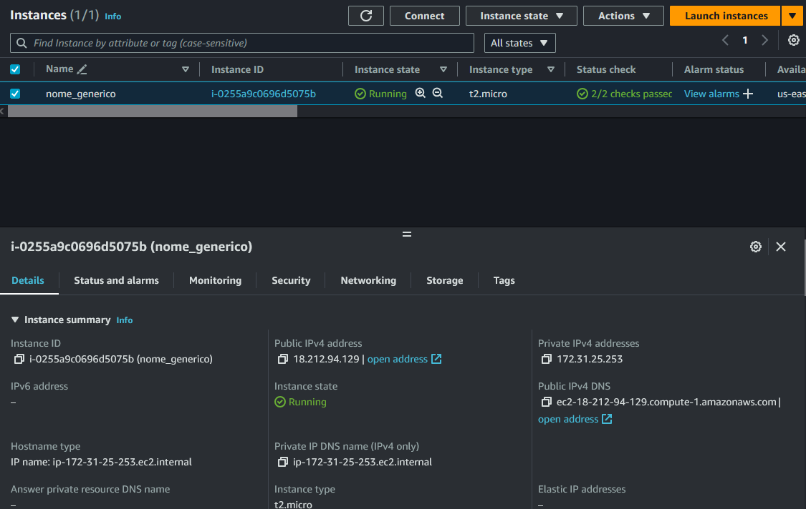
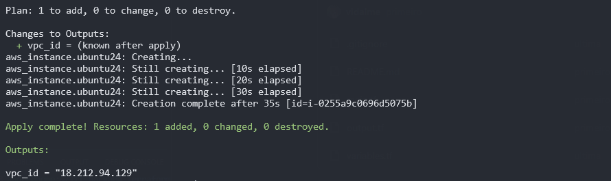

# Hands-On: Instalação do Terraform e criação de .TF para subir um EC2 e um S3

### A inicialização do Terraform ( terraform init ). [Vale 2 Pontos]

### O plano de execução do Terraform ( terraform plan ). [Vale 2 Pontos]

### A aplicação do plano ( terraform apply ). [Vale 2 Pontos]

### A verificação da instância EC2 e do bucket S3 no Console da AWS.
[Vale 2 Pontos]

### Link do Repositório no GitHub: [Vale 2 Pontos]
